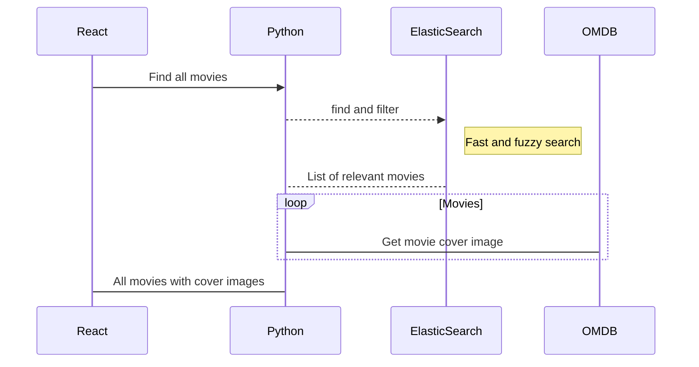

# Movie Search

A simple web application that allows users to search for movies and view their details.

## Installation

To install and run the movie search application, you will need to have Node.js and npm (the Node.js package manager) installed on your computer.

1.  Clone the repository:

`git clone https://github.com/dvirarad/movie-search.git` 

2.  Install the UI dependencies:
```
 cd frontend
 npm install
```
3.  Start the application:

`npm start` 

The application will be available at [http://localhost:3000](http://localhost:3000/).

## Usage

To use the movie search application, simply enter a movie title in the search field and click the search button. The application will display a list of movies matching your search query, along with their poster images and release dates. You can click on a movie to view its details, including the plot summary and cast information.

## Contributing

If you would like to contribute to the movie search application, please follow the guidelines in the `CONTRIBUTING.md` file.

## License

This project is licensed under the MIT License. See the `LICENSE` file for more details.


## UML diagrams



And this will produce a flow chart:

