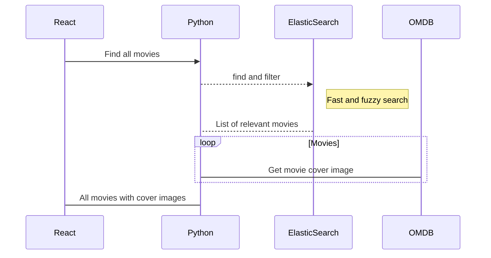

# Movie Search

A simple web application that allows users to search for movies and view their details.
This application is final version of this [blog tuturial](https://medium.com/@dvirarad/creating-a-movie-search-application-with-python-react-and-elasticsearch-14e0450b8bd)


## Installation

To install and run the movie search application, you will need to have the following dependencies installed on your computer:

-   Node.js and npm (the Node.js package manager)
-   Python 3.9
-   Elasticsearch

### Node.js and npm
Make sure you have Node.js and npm installed. You can check if you have them installed by running the following commands in your terminal:
```
node -v
npm -v
```
If you don't have Node.js and npm installed, you can download and install them from the official website ([https://nodejs.org/](https://nodejs.org/)) or using a package manager like Homebrew (for macOS) or Chocolatey (for Windows).

### Python 3.9

Make sure you have Python 3.x installed. You can check if you have it installed by running the following command in your terminal:


```python --version```

### Elasticsearch

Elasticsearch is a search engine based on the Lucene library. It provides a distributed, multitenant-capable full-text search engine with an HTTP web interface and schema-free JSON documents.

To install Elasticsearch, follow the instructions on the official website ([https://www.elastic.co/downloads/elasticsearch](https://www.elastic.co/downloads/elasticsearch)). You can also install Elasticsearch using a package manager like Homebrew (for macOS) or Chocolatey (for Windows).

Once Elasticsearch is installed, you can start the Elasticsearch server by running the following command in your terminal:

    docker pull elasticsearch:7.10.1

    docker run -d -p 9200:9200 -p 9300:9300 -e "discovery.type=single-node" elasticsearch:7.10.1

Verify that the Elasticsearch container is running by making a GET request to the  `http://localhost:9200`  endpoint:

    curl http://localhost:9200

You should see a response similar to the following:

    {  
      "name" : "a0d7c9e9a2c9",  
      "cluster_name" : "docker-cluster",  
      "cluster_uuid" : "M8pv9XzJQyGRlOyWwg8a-w",  
      "version" : {  
        "number" : "7.10.1",  
        "build_flavor" : "default",  
        "build_type" : "docker",  
        "build_hash" : "8c58350ce00f2920e7520c17285c605bca80db2c",  
        "build_date" : "2022-03-11T20:34:17.049771Z",  
        "build_snapshot" : false,  
        "lucene_version" : "8.7.0",  
        "minimum_wire_compatibility_version" : "6.8.0",  
        "minimum_index_compatibility_version" : "6.0.0-beta1"  
      },  
      "tagline" : "You Know, for Search"  
    }


### Clone the repository

To get started, clone the repository to your local machine:

Copy code

`git clone https://github.com/dvirarad/movie-search.git` 

This will create a local copy of the repository on your computer.

### Install the dependencies

Navigate to the project directory:

`cd movie-search` 

Install the Node.js dependencies:

`npm install` 

Install the Python dependencies:

`pip install -r requirements.txt` 

This will install all the required packages and libraries that the movie search application depends on.

### Start the application

To start the application in development mode, run the following command:

`npm start` 

This will start the React development server and the Python server. The application will be available at [http://localhost:3000](http://localhost:3000/) in your web browser.

### (Optional) Build the application for production

To create a production-ready version of the application, run the following command:

`npm run build` 

This will create a production-ready version of the application in the `build` directory. You can deploy the contents of the `build` directory to a hosting platform like GitHub Pages or Heroku.


## Usage

To use the movie search application, simply enter a movie title in the search field and click the search button. The application will display a list of movies matching your search query, along with their poster images and release dates. You can click on a movie to view its details, including the plot summary and cast information.

## Contributing

If you would like to contribute to the movie search application, please follow the guidelines in the `CONTRIBUTING.md` file.

## License

This project is licensed under the MIT License. See the `LICENSE` file for more details.


## UML diagrams



And this will produce a flow chart:


